# React Netease Music

React Netease Music——一个基于 React、TypeScript 的高仿网易云播放器。

## 项目体验地址

[高仿网易云音乐播放器](http://101.43.155.53:8080/)

## 功能列表

- [x] 登录目前仅支持扫码登录）
- [x] 发现页
  - [x] banner
  - [x] 推荐歌单
- [x] 全部歌单页
  - [x] 歌单分类查询
  - [x] 精品歌单
- [x] 排行榜页
- [x] 歌单详情页
- [x] 专辑详情页
- [x] 音乐播放详情页
  - [x] 歌曲评论
  - [x] 歌词滚动
  - [x] 点赞/取消点赞歌曲评论
  - [ ] 歌曲所在歌单
  - [ ] 相似歌曲推荐
  - [x] 收藏到歌单
- [x] 播放记录功能
  - [x] 播放列表
  - [x] 历史记录
- [x] 搜索功能
  - [x] 热门搜索关键字
  - [x] 搜索建议
  - [x] 搜索结果页
    - [x] 单曲
    - [x] 歌手
    - [x] 专辑
    - [x] 歌单
    - [x] 用户
- [x] 创建的歌单列表
- [x] 收藏的歌单列表
- [x] 全屏纯享
- [x] 私人 FM
- [x] 所有歌手页
- [x] 歌手详情页
- [x] MV 相关的页面与功能
- [x] 用户详情页
- [ ] 创建/编辑/删除歌单
- [ ] 私信/@我/评论等通知功能
- [ ] 主题换肤

## 技术栈

- React
- TypeScript
- axios
- redux,redux-tookit,redux-persist
- postcss
- antd-icon
- style-components
- prettier
- CSS Modules
- Webpack
- Eslint 做代码检查
- electron 打包客户端
- husky 做 git hooks
- commitlint 做 git commit hooks
- commitizen 做 commit 规范
- 项目没有使用额外的 ui 库等，目的是锻炼自己的编码能力

## 播放器的相关截图

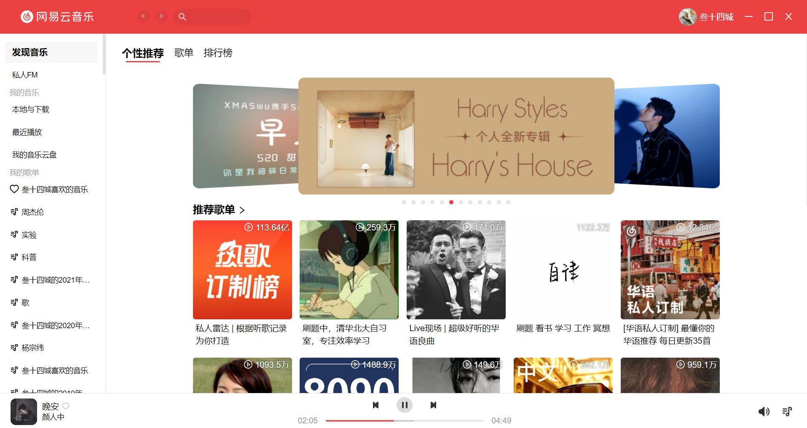

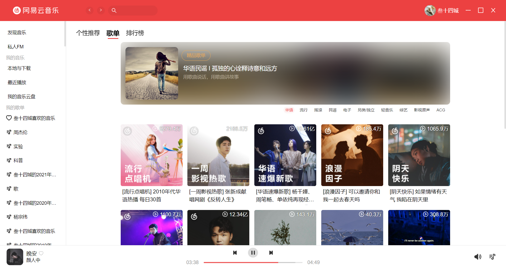

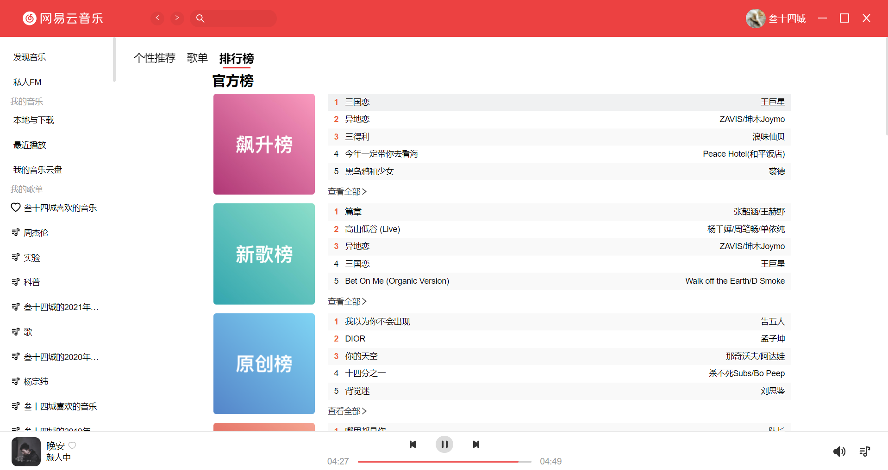

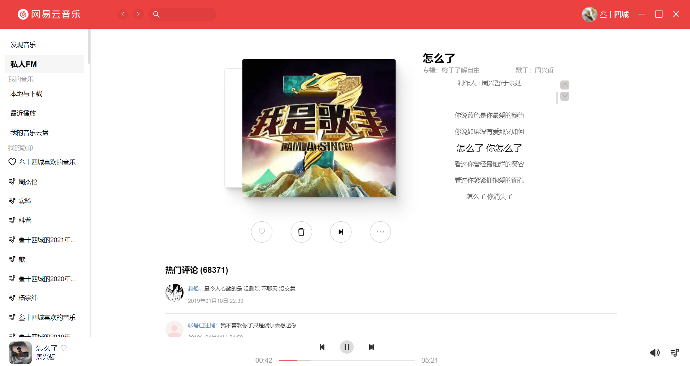

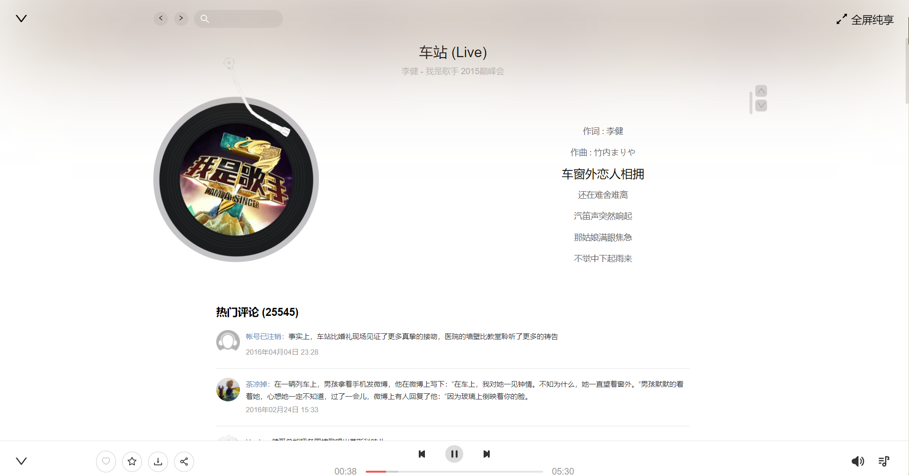

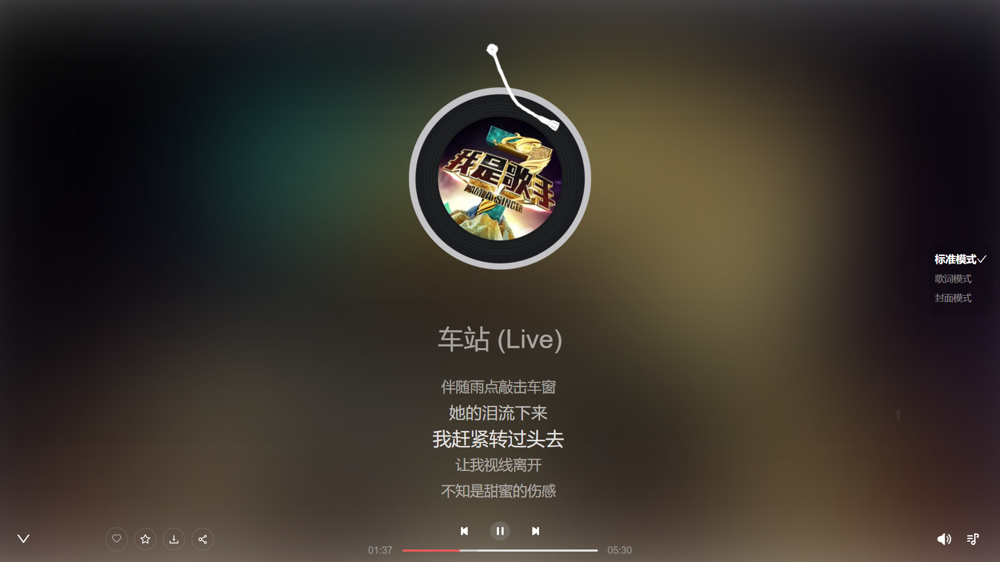

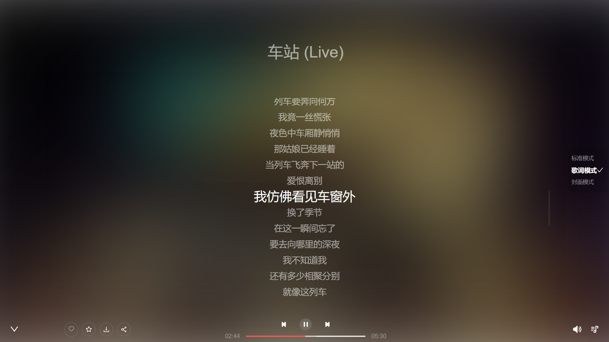

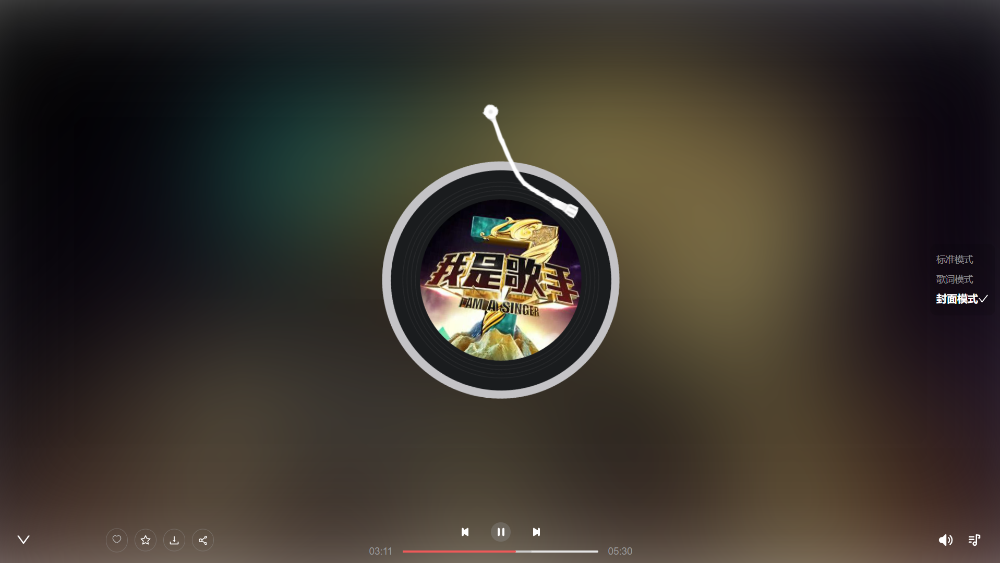

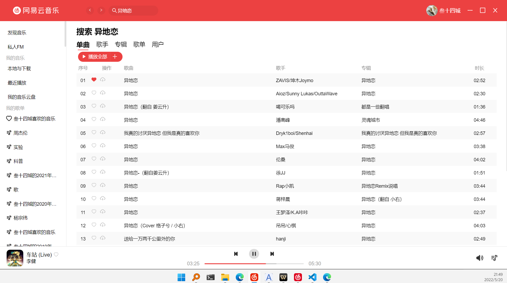

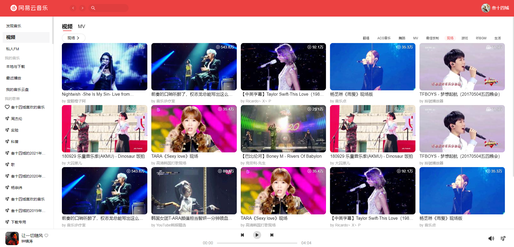

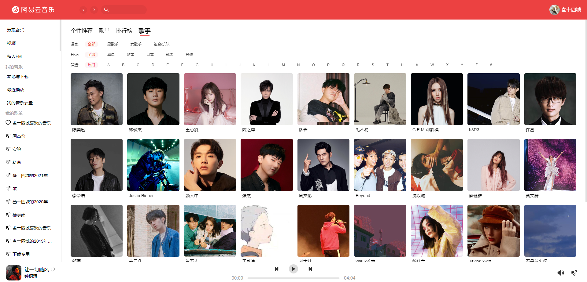

## 项目启动

```bash

pnpm install
//启动网页版
pnpm run dev:project
// 启动客户端版
// 见project-package.json

```

- 最后在浏览器中访问：`http://localhost:8080`


```

```
